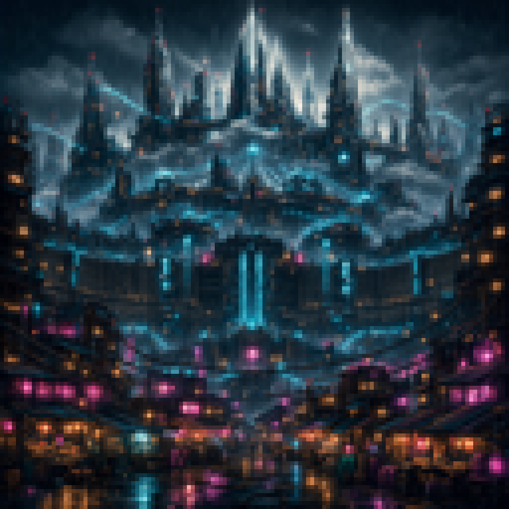
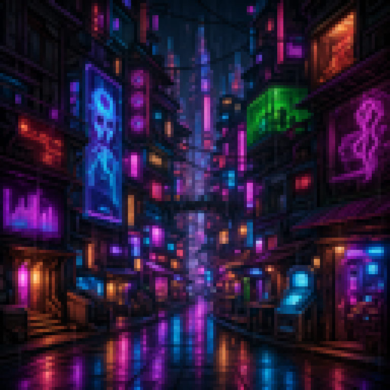
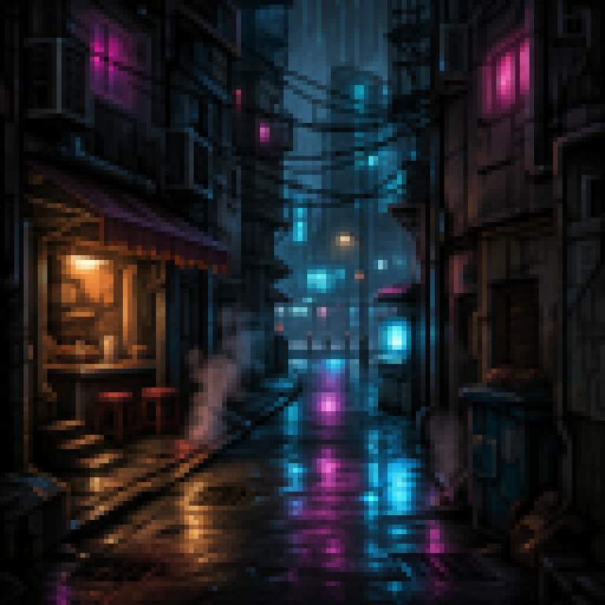
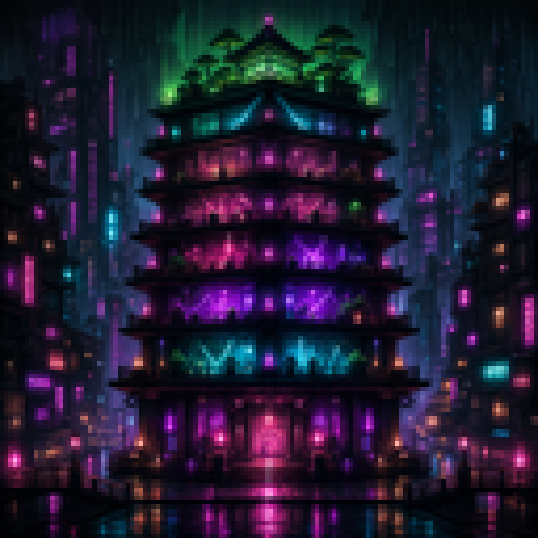
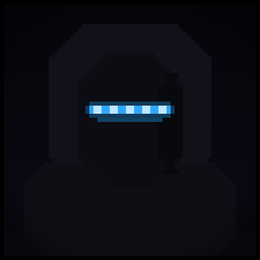
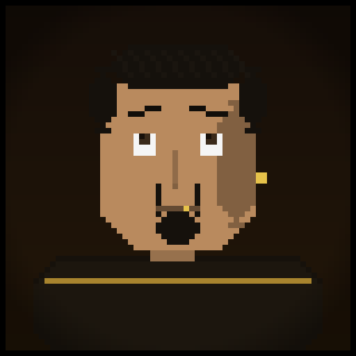
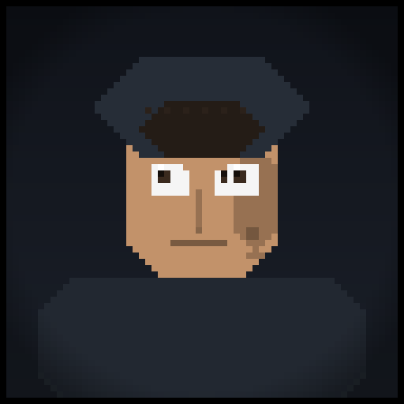
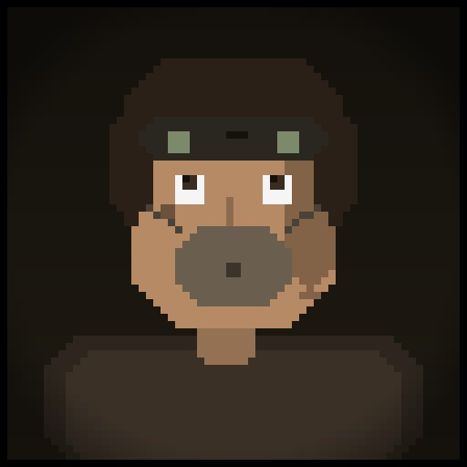

<div align="center">

# SIGNAL LOST
### 信号遗失



***The network died thirty years ago. Something inside it didn't.***

`Cyberpunk` · `Detective RPG` · `Story Rich` · `Choices Matter` · `No Combat` · `Atmospheric` · `Singleplayer`

</div>

---

## About This Game

Rain never stops falling on **Neo-Kowloon**. Thirty years ago the global network collapsed in a single night they now call the Severance, and the megacorporation **NEXUS** rebuilt the city out of the wreckage — water, power, data, and truth, all of it theirs.

You wake in an alley with no name, no memory, and an old neural implant humming behind your left ear. It shouldn't exist. It whispers in frequencies that don't have names, and sometimes, buried in the static, you hear something that sounds almost like a voice.

They call it **the Signal**. Most people can't hear it. The ones who can tend to disappear.

This is a knowledge-roguelike: a detective story where the only thing that levels up is **what you understand**. There are no stat bars to grind and no monsters to kill — only a city full of lies, a handful of people who might help you or sell you out, and a truth that gets stranger the deeper you dig. Every run is narrated live, so no two descents into Neo-Kowloon are ever quite the same.

> **How far will you follow the Signal before it costs you something you can't get back?**

---

## The City

<table>
  <tr>
    <td align="center"><br/><b>The Sprawl</b><br/><sub>neon slums &amp; rain-slick alleys</sub></td>
    <td align="center"><br/><b>Neon Row</b><br/><sub>where the city sells its dreams</sub></td>
    <td align="center"><br/><b>Rain Alley</b><br/><sub>the place you woke up</sub></td>
  </tr>
  <tr>
    <td align="center"><br/><b>The Wet Market</b><br/><sub>everything has a price</sub></td>
    <td align="center"><br/><b>The Pagoda</b><br/><sub>light, music, and worse</sub></td>
    <td align="center"><br/><b>Chrome Heights</b><br/><sub>where the rich stay dry</sub></td>
  </tr>
</table>

<div align="center"><sub>Climb from the flooded undercity to the glass towers — every district gated by what you know, who you've convinced, and what you're willing to risk.</sub></div>

---

## Why You'll Want to Play

- **Knowledge *is* progression.** No XP, no levels. You grow stronger by discovering facts, verifying rumors, decoding ciphers, and connecting clues. What you know is literally what you can *do*.
- **No combat. Real stakes.** You are fragile and the city is not. Pull a weapon and you will probably die. Survive with cunning, leverage, and the right words at the right moment.
- **Talk like your life depends on it — it does.** Every major character runs on **trust, loyalty, and knowledge gates**. They can guide you, betray you, or quietly feed you exactly the wrong thing.
- **The Theorize mechanic.** Stitch your discoveries into theories. Land a true one and new paths, doors, and conversations crack open. Guess wrong and you tip your hand.
- **A living world.** NPCs and factions act on their own schedule whether you're watching or not. The clock keeps moving; the city doesn't wait for you.
- **Many endings, most of them lies you tell yourself.** Plenty of conclusions *look* like victory. Very few actually are — and the real ones can't be stumbled into by luck.
- **Choose your way in.** Start as a **Street Runner**, a **Corporate Exile**, or a **Netrunner** — each opening with different knowledge, contacts, and gear.
- **Endlessly re-narrated.** The story is generated by a live language model, so the prose, the side-roads, and the texture of each run shift every time you play.
- **Bilingual by design.** Play in **English** or **中文**, switchable mid-game.
- **Tune the noir.** Difficulty from forgiving to brutal; verbosity, tone, and atmosphere all adjustable in settings.

---

## People You'll Meet

<table>
  <tr>
    <td align="center"><br/><sub>You</sub></td>
    <td align="center"><br/><sub>A voice in the static</sub></td>
    <td align="center"><br/><sub>The fixer</sub></td>
    <td align="center"><br/><sub>A dealer on the Row</sub></td>
    <td align="center"><br/><sub>A street kid</sub></td>
    <td align="center"><br/><sub>A scavenger</sub></td>
  </tr>
</table>

<div align="center"><sub>Trust no one completely. Trust no one too little. The city eats people who get that balance wrong.</sub></div>

---

## Getting Started

Signal Lost runs in your browser, with a live chat panel and a real-time dashboard of your knowledge, traces, inventory, and the world around you.

### 1. Prerequisites

- **Python 3.13+**
- **[uv](https://docs.astral.sh/uv/)** — the package manager used by this project

```bash
uv sync   # install dependencies
```

### 2. Pick a narrator (LLM provider)

The story is told by a language model. Configure one in `settings/provider.json`:

```json
{
  "provider": "anthropic",
  "model": "claude-sonnet-4-6-20250514",
  "temperature": 0.7
}
```

Supported providers — including **free, no-API-key options**:

| Provider | Notes |
|----------|-------|
| `anthropic` | API key via `ANTHROPIC_API_KEY` in `.env` |
| `openai` | API key via `OPENAI_API_KEY` in `.env` |
| `openrouter` | One gateway, many models (`OPENROUTER_API_KEY`) |
| `lmstudio` | Run a local model — **no API cost at all** |
| `claude-code` | Use the Claude Code CLI as the backend — **no API key needed** |
| `codex` | Use the OpenAI Codex CLI as the backend — **no API key needed** |

### 3. Play

```bash
uv run gui/run_gui.py              # launches in your browser
uv run gui/run_gui.py --port 8080  # custom port
uv run gui/run_gui.py --no-open    # don't auto-open the browser
```

New Game, Resume, Load, Save, and provider settings are all available from the browser. That's it — the rain is already falling.

<details>
<summary>Optional: headless mode &amp; testing</summary>

```bash
# Headless engine (file-polling; great for AI-agent playthroughs)
uv run tests/scripts/play_headless.py

# Test suites
uv run tests/scenarios/smoke_test.py        # quick validation (no LLM)
uv run tests/scenarios/regression.py        # regression tests (no LLM)
uv run tests/scenarios/full_playthrough.py  # automated playthrough (requires LLM)
```

</details>

---

<div align="center">

### The Signal is waiting. Will you listen?
*信号在等待。你愿意聆听吗？*

</div>
